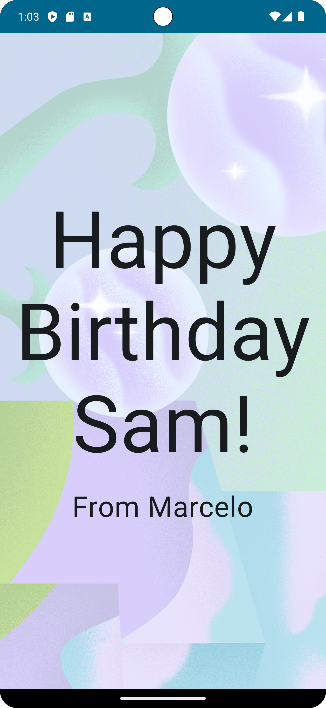

# Birthday Card App

A simple app to display a birthday card using Jetpack Compose components like ```Column```, ```Row```, ```Box```, ```Text```, ```Image```, and ```Modifier.```

<p align="center">
  
</p>